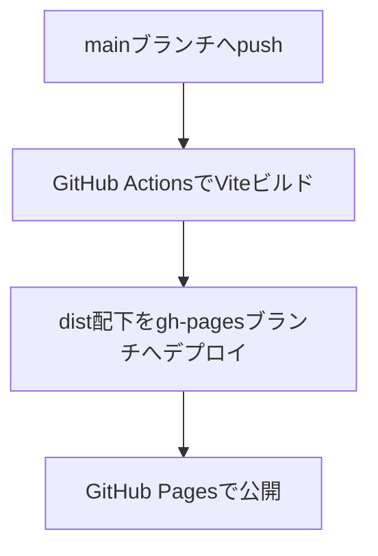

# ポップコーンメーカー

## Vite + GitHub Pages運用手順

1. `npm run build` でdistディレクトリを生成
2. GitHubへpushするとActionsが自動でgh-pagesブランチへデプロイ
3. `https://ユーザー名.github.io/リポジトリ名/` で公開

### ワークフロー図（Mermaid）

このプロジェクトは、GitHub Pages上で動作するシンプルな「ポップコーンメーカー」ゲームです。
クリックでトウモロコシを育てて収穫し、今後アップグレードや自動化要素の追加も予定しています。

## ゲームの機能
- ボタンをクリックしてトウモロコシを獲得
- 獲得数はローカルストレージに保存され、再訪時も継続
- 今後アップグレード機能や自動化要素を追加予定

## GitHub Pagesでのアクセス方法
1. リポジトリの「Settings」→「Pages」から「Branch」を`main`（または`master`）に設定
2. デプロイ後、`https://ユーザー名.github.io/リポジトリ名/` でアクセス可能

## ローカルでの実行方法
1. リポジトリをクローン
2. index.htmlをブラウザで開くだけでプレイ可能（追加のセットアップ不要）

## プロジェクト構成
- index.html … ゲーム本体
- script.js … ゲームロジック
- style.css … スタイル
- .gitignore … 不要ファイル除外設定
- README.md … プロジェクト説明

## ライセンス
MIT